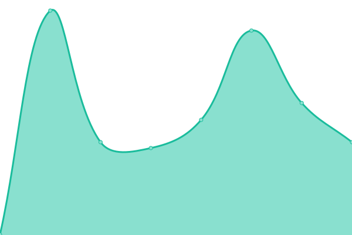

# [📈 Live Status](https://GoodVibesGaming.github.io/upptime): <!--live status--> **🟧 Partial outage**

This repository contains the open-source uptime monitor and status page for [GoodVibesGaming](https://GoodVibesGaming.github.io/upptime), powered by [Upptime](https://github.com/upptime/upptime).

With [Upptime](https://upptime.js.org), you can get your own unlimited and free uptime monitor and status page, powered entirely by a GitHub repository. We use [Issues](https://github.com/GoodVibesGaming/upptime/issues) as incident reports, [Actions](https://github.com/GoodVibesGaming/upptime/actions) as uptime monitors, and [Pages](https://GoodVibesGaming.github.io/upptime) for the status page.

<!--start: status pages-->
<!-- This summary is generated by Upptime (https://github.com/upptime/upptime) -->
<!-- Do not edit this manually, your changes will be overwritten -->
<!-- prettier-ignore -->
| URL | Status | History | Response Time | Uptime |
| --- | ------ | ------- | ------------- | ------ |
|  Panel Frontend | 🟨 Degraded | [panel-frontend.yml](https://github.com/GoodVibesGaming/upptime/commits/HEAD/history/panel-frontend.yml) | 

 4967ms
     
 | 

<a href="https://GoodVibesGaming.github.io/upptime/history/panel-frontend">0.00%</a>
    

|  Panel API | 🟥 Down | [panel-api.yml](https://github.com/GoodVibesGaming/upptime/commits/HEAD/history/panel-api.yml) | 

 0ms
     
 | 

<a href="https://GoodVibesGaming.github.io/upptime/history/panel-api">0.00%</a>
    

|  Palworld Tunnel (Connection URL) | 🟨 Degraded | [palworld-tunnel-connection-url.yml](https://github.com/GoodVibesGaming/upptime/commits/HEAD/history/palworld-tunnel-connection-url.yml) | 

 62ms
     
 | 

<a href="https://GoodVibesGaming.github.io/upptime/history/palworld-tunnel-connection-url">0.00%</a>
    

|  Palworld Server | 🟥 Down | [palworld-server.yml](https://github.com/GoodVibesGaming/upptime/commits/HEAD/history/palworld-server.yml) | 

 40ms
     
 | 

<a href="https://GoodVibesGaming.github.io/upptime/history/palworld-server">0.00%</a>
    

|  ATS Server | 🟥 Down | [ats-server.yml](https://github.com/GoodVibesGaming/upptime/commits/HEAD/history/ats-server.yml) | 

 39ms
     
 | 

<a href="https://GoodVibesGaming.github.io/upptime/history/ats-server">0.00%</a>
    

|  [Discord Invite](https://discord.gg/vxuKHHuQNk) | 🟩 Up | [discord-invite.yml](https://github.com/GoodVibesGaming/upptime/commits/HEAD/history/discord-invite.yml) | 

 386ms
     
 | 

<a href="https://GoodVibesGaming.github.io/upptime/history/discord-invite">100.00%</a>
    

<!--end: status pages-->

[**Visit our status website →**](https://GoodVibesGaming.github.io/upptime)

## 📄 License

- Powered by: [Upptime](https://github.com/upptime/upptime)
- Code: [MIT](./LICENSE) © [Anand Chowdhary](https://anandchowdhary.com), supported by [Pabio](https://pabio.com)
- Data in the `./history` directory: [Open Database License](https://opendatacommons.org/licenses/odbl/1-0/)
